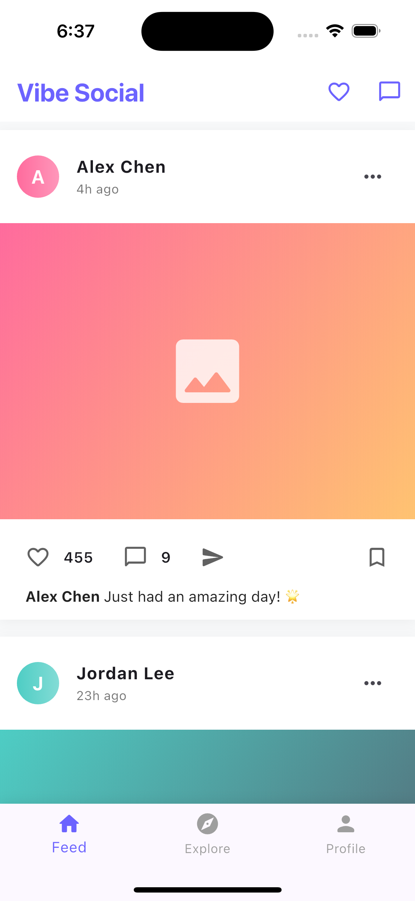
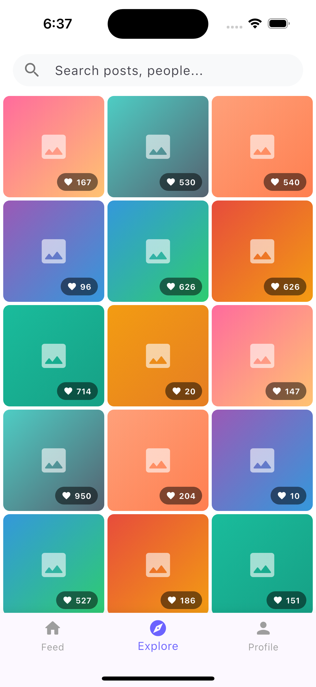
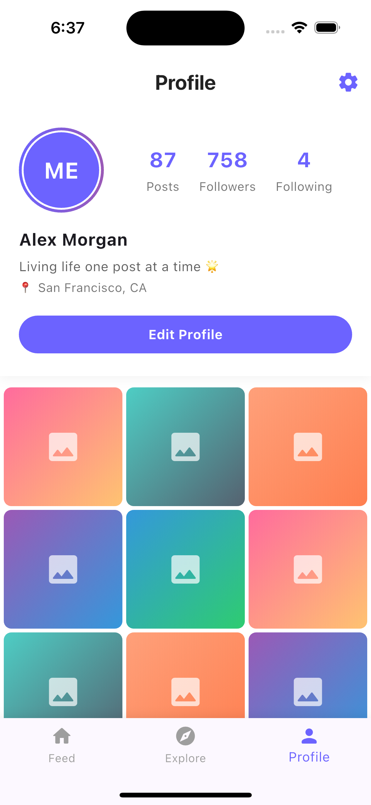

# Vibe Social - Flutter Social Media App

A modern social media app built with Flutter featuring a beautiful gradient design, feed, explore, and profile pages.

## ✨ Features

- 📱 **Feed Page**: Instagram-style posts with likes, comments, bookmarks, and share functionality
- 🔍 **Explore Page**: Grid view of posts with search bar and like counts
- 👤 **Profile Page**: User profile with stats (posts, followers, following) and post grid
- 🎨 **Modern UI**: Beautiful gradient designs and Material 3 components
- 💜 **Interactive**: Tap to like/unlike posts and bookmark your favorites

## 📸 Screenshots

<div align="center">
  
  
  
</div>

## 🎨 Design Highlights

- Clean, modern UI with purple theme (#6C63FF)
- Beautiful gradient backgrounds
- Smooth shadows and elevations
- Rounded icons and buttons
- Material 3 design system
- Interactive animations

## 🚀 Getting Started

### Prerequisites
- Flutter SDK installed
- Dart SDK installed

### Installation

1. Clone the repository:
```bash
git clone https://github.com/MO-PratikG-29356/vibe_coding_app.git
cd vibe_coding_app
```

2. Install dependencies:
```bash
flutter pub get
```

3. Run the app:
```bash
flutter run
```

## 📁 Project Structure

```
lib/
  └── main.dart          # Main app with all pages
```

## 🛠️ Built With

- Flutter
- Dart
- Material 3 Design

## 📝 License

This project is open source and available under the MIT License.
